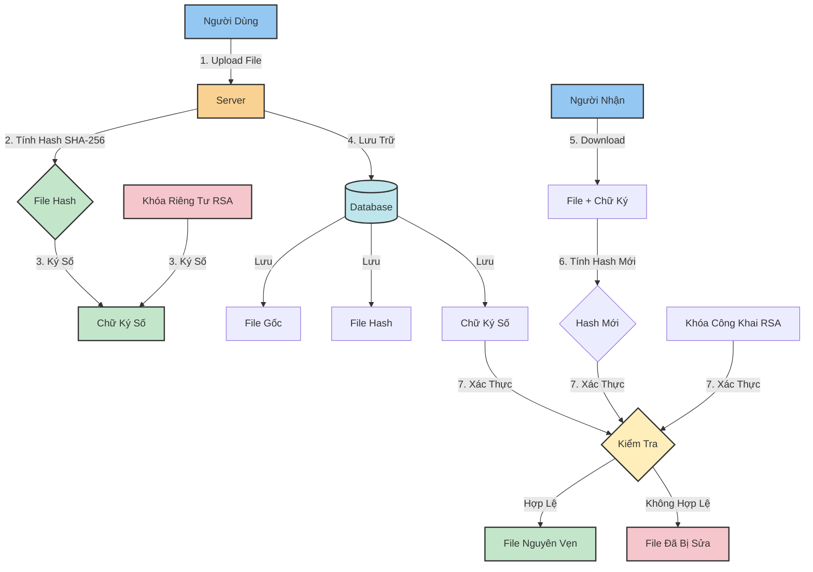

<h1 align="center">🔐 Hệ Thống Truyền File An Toàn với Chữ Ký Số RSA</h1>

## 📋 Mô Tả Hệ Thống

Hệ thống Truyền File An Toàn với Chữ Ký Số RSA là một giải pháp bảo mật toàn diện cho việc trao đổi và lưu trữ file. Hệ thống sử dụng công nghệ mã hóa RSA hiện đại với độ dài khóa 2048-bit để đảm bảo tính xác thực và toàn vẹn của dữ liệu.

### 🔒 Cơ Chế Hoạt Động

#### Sơ Đồ Mã Hóa và Giải Mã RSA


Trong đó:
- **M**: Văn bản gốc cần mã hóa
- **e, n**: Khóa công khai (Public Key) dùng để mã hóa
- **d, n**: Khóa riêng tư (Private Key) dùng để giải mã
- **c**: Văn bản đã được mã hóa

#### Quy Trình Hoạt Động:

1. **Tạo Khóa RSA**:
   - Hệ thống tạo cặp khóa RSA 2048-bit
   - Khóa công khai (e,n) dùng để xác thực
   - Khóa riêng tư (d,n) dùng để ký số

2. **Quy Trình Ký Số**:
   - Tính toán mã hash SHA-256 của file
   - Ký số hash bằng khóa riêng tư
   - Lưu trữ chữ ký số cùng file

3. **Xác Thực File**:
   - Tính toán lại hash của file
   - Xác thực chữ ký bằng khóa công khai
   - Kiểm tra tính toàn vẹn dữ liệu

## ✨ Tính Năng Chính

### 🔑 Quản Lý Khóa
- Tạo cặp khóa RSA 2048-bit tự động
- Xuất/Nhập khóa công khai và riêng tư
- Quản lý nhiều cặp khóa cho nhiều người dùng
- Bảo vệ khóa riêng tư an toàn

### 📤 Upload và Ký Số
- Tải lên file với giao diện thân thiện
- Ký số tự động khi có khóa RSA
- Hỗ trợ nhiều định dạng file
- Giới hạn dung lượng file 50MB
- Tính toán và lưu trữ mã hash SHA-256

### ✅ Xác Thực và Kiểm Tra
- Xác thực chữ ký số real-time
- Kiểm tra tính toàn vẹn file
- Cảnh báo khi file bị thay đổi
- Hiển thị trạng thái xác thực trực quan
- Lưu lịch sử xác thực





### 📊 Quản Lý File
- Giao diện quản lý file trực quan
- Xem thông tin chi tiết file
- Tải xuống file và chữ ký
- Xóa file với xác nhận
- Phân loại file theo trạng thái

### 🔍 Tính Năng Bảo Mật
- Mã hóa RSA 2048-bit
- Hash file với SHA-256
- Xác thực người dùng
- Kiểm soát truy cập
- Ghi log hoạt động

## 🛠️ Công Nghệ Sử Dụng

- **Backend**: Python Flask
- **Database**: SQLAlchemy
- **Mã Hóa**: Thư viện Cryptography
- **Frontend**: Bootstrap 5, Font Awesome
- **Xác Thực**: SHA-256, RSA

## 📋 Yêu Cầu Hệ Thống

```
Python 3.11+
Các thư viện trong requirements.txt
```

## 🚀 Cài Đặt và Chạy

1. Cài đặt các thư viện cần thiết:
```bash
pip install -r requirements.txt
```

2. Chạy ứng dụng:
```bash
python main.py
```

Ứng dụng sẽ chạy tại địa chỉ: `http://0.0.0.0:5000`

## 💡 Hướng Dẫn Sử Dụng

1. **Tạo Khóa RSA**:
   - Truy cập trang Quản lý khóa
   - Nhấn "Tạo cặp khóa mới"
   - Tải xuống khóa công khai và khóa riêng tư

2. **Upload File**:
   - Chọn file cần upload
   - File sẽ được tự động ký số nếu có khóa RSA
   - Xem thông tin file và chữ ký trong trang Quản lý file

3. **Xác Thực File**:
   - Truy cập trang Quản lý file
   - Nhấn nút xác thực với file đã chọn
   - Kiểm tra kết quả xác thực

## 🔒 Bảo Mật

- Sử dụng mã hóa RSA 2048-bit
- Hash file với SHA-256
- Lưu trữ an toàn khóa và file
- Xác thực tự động

## 📁 Demo Chương trình


## 📁 Cấu Trúc Thư Mục

```
├── instance/                  # Thư mục chứa database
│   └── secure_transfer.db    # File database SQLite
├── keys/                     # Thư mục lưu trữ khóa
├── static/                   # Tài nguyên tĩnh
│   ├── css/                 # Thư mục CSS
│   │   └── style.css       # File CSS chính
│   └── js/                  # Thư mục JavaScript
│       └── main.js         # File JavaScript chính
├── templates/                # Thư mục template
│   ├── base.html           # Template cơ sở
│   ├── files.html          # Trang quản lý file
│   ├── index.html          # Trang chủ
│   ├── index_new.html      # Trang chủ mới
│   ├── keys.html           # Trang quản lý khóa
│   └── upload.html         # Trang upload file
├── uploads/                  # Thư mục lưu trữ file
├── app.py                    # Khởi tạo ứng dụng Flask
├── crypto_utils.py           # Tiện ích mã hóa
├── main.py                   # File chạy chính
├── models.py                 # Mô hình dữ liệu
├── routes.py                 # Định tuyến và xử lý request
├── requirements.txt          # Danh sách thư viện
└── README.md                 # Tài liệu hướng dẫn
```

## 🤝 Đóng Góp

Mọi đóng góp và phản hồi đều được chào đón! Hãy tạo issue hoặc pull request để cải thiện hệ thống.

## 📄 Giấy Phép

MIT License - Xem file LICENSE để biết thêm chi tiết.
